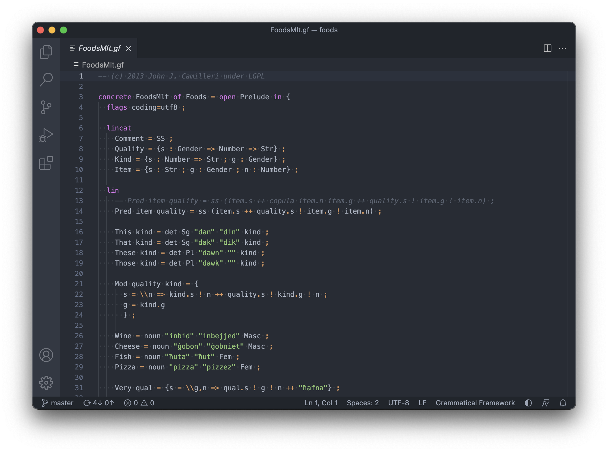

# Grammatical Framework language support for Visual Studio Code

Adds syntax highlighting to Grammatical Framework (`.gf`) files for Visual Studio Code.

The extension is based on:
- John Camilleri's [extension for Atom](https://github.com/GrammaticalFramework/atom-language-gf)
- Rob Clouth's work [porting it to VS Code](https://github.com/robclouth/gf-vscode)
- Peter Ljunglöf's [improvements](https://github.com/GrammaticalFramework/gf-vscode/commits/master?author=heatherleaf)
- Andreas Källberg's [language server client extension](https://github.com/anka-213/gf-vscode)

To learn more about GF visit: <https://www.grammaticalframework.org>
